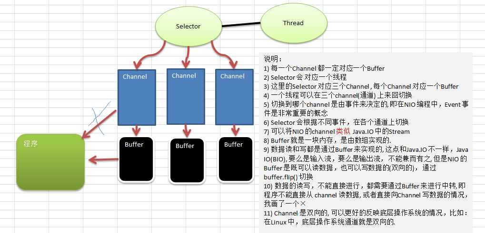
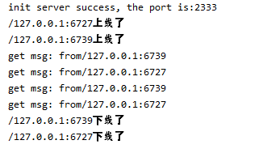
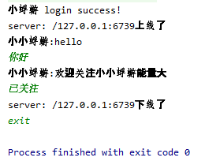
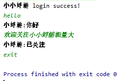

## 功能

1)编写一个 NIO 群聊系统，实现服务器端和客户端之间的数据简单通讯（非阻塞）

2)实现多人群聊

3)服务器端：可以监测用户上线，离线，并实现消息转发功能

4)客户端：通过channel 可以无阻塞发送消息给其它所有用户，同时可以接受其它用户发送的消息(由服务器转发得到)

## 基本知识

### 三种网络I/O

#### BIO

同步阻塞 IO，Block IO，IO 操作时会阻塞线程，并发处理能力低。

Socket 编程就是 BIO，一个 socket 连接一个处理线程（这个线程负责这个 Socket 连接的一系列数据传输操作）。阻塞的原因在于：操作系统允许的线程数量是有限的，多个 socket 申请与服务端建立连接时，服务端不能提供相应数量的处理线程，没有分配到处理线程的连接就会阻塞等待或被拒绝。

BIO方式适用于连接数目比较小且固定的架构，这种方式对服务器资源要求比较高，并发局限于应用中，JDK1.4以前的唯一选择，但程序简单易理解。

#### NIO

同步非阻塞 IO，None-Block IO

NIO 是对 BIO 的改进，基于 Reactor 模型。我们知道，一个 socket 连接只有在特定时候才会发生数据传输 IO 操作，大部分时间这个“数据通道”是空闲的，但还是占用着线程。

NIO 作出的改进就是“一个请求一个线程”，在连接到服务端的众多 socket 中，只有需要进行 IO 操作的才能获取服务端的处理线程进行 IO。这样就不会因为线程不够用而限制了 socket 的接入

#### AIO

异步非阻塞 IO

这种 IO 模型是由操作系统先完成了客户端请求处理再通知服务器去启动线程进行处理。AIO 也称 NIO2.0，在 JDK7开始支持

AIO 引入异步通道的概念，采用了 Proactor 模式，简化了程序编写，有效的请求才启动线程，它的特点是先由操作系统完成后才通知服务端程序启动线程去处理，一般适用于连接数较多且连接时间较长的应用

### NIO的三大核心组件

#### Channel(通道)

NIO的通道类似于流，但有些区别

- 通道可以同时进行读写，而流只能读或者只能写

- 通道可以实现异步读写数据

- 通道可以从缓冲读数据，也可以写数据到缓冲

- 通道是一个接口，有多种通道类型实现

#### Buffer(缓冲区)

缓冲区本质上是一个可以读写数据的内存块，可以理解成是一个容器对象(含数组)，该对象提供了一组方法，可以更轻松地使用内存块，缓冲区对象内置了一些机制，能够跟踪和记录缓冲区的状态变化情况。Channel 提供从文件、网络读取数据的渠道，但是读取或写入的数据都必须经由 Buffer

#### Selector(选择器)

用一个线程处理多个客户端连接时会用到selector

Selector 能够检测多个注册的通道上是否有事件发生(注意:多个Channel以事件的方式可以注册到同一个Selector)，如果有事件发生，便获取事件然后针对每个事件进行相应的处理。这样就可以只用一个单线程去管理多个通道，也就是管理多个连接和请求

只有在 连接/通道 真正有读写事件发生时，才会进行读写，就大大地减少了系统开销，并且不必为每个连接都创建一个线程，不用去维护多个线程。避免了多线程之间的上下文切换导致的开销

### NIO三大核心组件的关系




## 实现时的一些细节

### 信息以byte形式高效传送

不使用传统的json等数据结构传输信息，而是使用bytebuffer，每次发送一个bytebuffer

### TCP沾包、半包问题

#### 产生原因

1. 应用程序写入的数据大于套接字缓冲区大小，这将会发生拆包。
2. 应用程序写入数据小于套接字缓冲区大小，网卡将应用多次写入的数据发送到网络上，这将会发生粘包。

3. 进行MSS（最大报文长度）大小的TCP分段，当TCP报文长度-TCP头部长度>MSS的时候将发生拆包。

4. 接收方法不及时读取套接字缓冲区数据，这将发生粘包。

#### 为什么沾包、半包会导致异常

将byte转换回字符串时，会先读取整个buffer，然后再使用byte数组生成字符串

1. 如果只接收一部分可能会导致中间某一个字符只接收了一部分byte，所以解码的时候会产生异常。
2. 如果接收多个bytebuffer，虽然不会产生异常，但如果中间有一些自定义的分隔符类的东西以标志不同用途会导致解码错误。

#### 沾包半包问题共有三种情况

1. 全沾包：多个完整的bytebuffer组成
2. 半包：只有一个完整的bytebuffer的一部分
3. 全包+半包：有多个完整的bytebuffer和一个不完整的bytebuffer组成

#### 沾包、半包问题的解决方案

TCP本身是面向流的，作为网络服务器，如何从这源源不断涌来的数据流中拆分出或者合并出有意义的信息呢？通常会有以下一些常用的方法：

1. 发送端给每个数据包添加包首部，首部中应该至少包含数据包的长度，这样接收端在接收到数据后，通过读取包首部的长度字段，便知道每一个数据包的实际长度了。

2. 发送端将每个数据包封装为固定长度（不够的可以通过补0填充），这样接收端每次从接收缓冲区中读取固定长度的数据就自然而然的把每个数据包拆分开来。(比较浪费空间)

3. 可以在数据包之间设置边界，如添加特殊符号，这样，接收端通过这个边界就可以将不同的数据包拆分开。(存在文字中包含要分隔的特殊符号，导致分隔错误的情况)

## server端

server端只创建一个线程用以处理所有逻辑，实际上如果需要更高的效率可以添加不同的线程。

### 监听

启动server端后，server端开始监听，监听到请求则开始处理，处理完成后继续监听。

监听的核心逻辑如下

```java
// 开始监听所有请求
public void listen(){
    try{
        // 循环遍历是否有事件
        while (true){
            // 阻塞0.1s看是否有客户端连接，防止CPU全速空转
            if(this.selector.select(100)==0){
                continue;
            }
            // 取得selectionkey，判断通道里的事件
            Iterator<SelectionKey> iterator = this.selector.selectedKeys().iterator();
            while (iterator.hasNext()){
                SelectionKey selectedKey = iterator.next();
                if(selectedKey.isAcceptable()){
                    // 如果是连接事件，则给客户端生成一个channel
                    SocketChannel socketChannel = this.serverSocketChannel.accept();
                    socketChannel.configureBlocking(false);
                    // 向selector注册
                    socketChannel.register(this.selector, SelectionKey.OP_READ);
                    // 已经登录完成，接下来调用登录处理逻辑
                    this.login(socketChannel);
                }else if(selectedKey.isReadable()){
                    // 收到发送来的数据，启动数据处理逻辑
                    readData(selectedKey);
                }
                iterator.remove();
            }
        }
    }catch (Exception e){
        e.printStackTrace();
    }
}
```

### 数据从buffer中读出

由于客户端可能发送来的数据较大，而且我初始化的buffer读取每次最多读1024byte，所以会尝试循环读取直到不能读出数据再结束

```java
/**
 * 读取消息逻辑
 * @param selectionKey
 */
private void readData(SelectionKey selectionKey){
    try{
        // 通过key反向得到channel
        SocketChannel socketChannel = (SocketChannel)selectionKey.channel();
        // 创建读取数据的缓冲区
        ByteBuffer byteBuffer = this.msgBuffer;
        // 首先清空buffer
        byteBuffer.clear();
        // 读取数据，并记录数据大小
        int count = socketChannel.read(byteBuffer);
        if(count>0){
            System.out.println("get msg: from"+socketChannel.getRemoteAddress().toString());
            // 防止消息信息太大出现需要多次读取
            while (count>0){
                sendData2All(socketChannel, byteBuffer);
                byteBuffer.clear();
                count = socketChannel.read(byteBuffer);
            }
        }else if(count==-1){
            this.logout((SocketChannel)selectionKey.channel());
        }
    }catch (Exception e){
        try {
            this.logout((SocketChannel)selectionKey.channel());
        } catch (IOException ex) {
            ex.printStackTrace();
        }
    }
}
```


## client端

client端共有两个线程，一个线程用来监听服务器发来的信息，一个线程用于从控制台读取输入。

### 处理沾包、半包问题

选择在所有的信息前面添加数据长度选项的方法为了处理沾包、半包、拆包带来的问题。

#### 发送

为了防止由于半包问题导致表示信息长度的int的4个byte被拆分成两部分，并且拆包后包数据大小一般都为4的整数倍，所以我们对信息进行处理，如果数据的byte数组长度不是4的倍数，则将byte数组长度补足为4的倍数。

```java
/**
 * 将信息发送出去，为了防止沾包和半包的问题，会首先发送长度信息，然后再发送具体信息
 * @param msgs
 * @return 返回信息状态，-1表示退出，0表示正常发送
 * @throws IOException
 */
public int sendMsg(String msgs) throws IOException {
    if("exit".equals(msgs)){
        return -1;
    }else{
        String baseBlank = "aaaa";   // 先填充四个无意义字符，后续用于填充进去字符串长度
        // 用来存储数据的byte数组
        byte[] msgBytes;
        int flag;
        // 如果有多行数据则分开发送
        String[] splitedData = msgs.split("\n");
        for (String msg : splitedData) {
            msgBytes = (baseBlank + this.username + ":" + msg).getBytes();
            // 用以保证所有发送的信息长度都为4的倍数
            flag = msgBytes.length % 4;
            if(flag>0){
                msgBytes = java.util.Arrays.copyOf(msgBytes, msgBytes.length + 4 - flag);
            }
            // 将消息长度信息写入消息体中
            System.arraycopy(int2Bytes(msgBytes.length-4), 0, msgBytes, 0, 4);
            // 发送
            this.socketChannel.write(ByteBuffer.wrap(msgBytes));
        }
        return 0;
    }
}
```

#### 接收

为了处理半包、沾包问题，从buffer中读取数据需要进行额外的处理，具体逻辑在代码中都有注释。

关键在于信息长度的int数据的获取，和沾包问题带来的一个buffer读多次的问题。

```java
/**
 * 读取数据。读取数据时需要处理沾包和半包的问题
 * @param selectedKey
 * @throws IOException
 */
public void readData(SelectionKey selectedKey) throws IOException {
    SocketChannel channel = (SocketChannel)selectedKey.channel();
    ByteBuffer byteBuffer = this.msgBuffer;
    // 首先清空缓存
    byteBuffer.clear();
    // 首先从channel中读取一部分数据到buffer
    int count = channel.read(byteBuffer);
    // 将buffer从写状态转换为读状态
    byteBuffer.flip();
    // 首先获取信息的长度
    int msgLen = byteBuffer.getInt();
    int index = 0;
    int startOffset = 4;
    int getDataLen;
    // 只要还有数据就一直读取，只有在读取完一个阶段后才会执行其他任务
    while (count>0 || msgLen!=0){   // 只有读完所有完整的信息才算结束，出现半包则继续等待
        // 刚开始接收信息要首先获取int长度，共4个byte
        if(index==0) {
            index++;
            getDataLen = Math.min(count - startOffset, msgLen);
            byteArrayOutputStream.write(byteBuffer.array(), startOffset, getDataLen);
            // 判断当前是否读完了一条信息
            if(getDataLen==msgLen){   // 已经读完了一条信息
                // 判断读完这条信息后是否把整个buffer读完了，防止出现沾包的情况
                if(msgLen==(count - startOffset)){   // 读完这条信息后把整个buffer读完了，也就是没有出现沾包的情况
                    byteBuffer.clear();
                    if(byteArrayOutputStream.size()>0)
                        this.readMsg(channel, byteArrayOutputStream);
                    // 初始化信息，防止之后还有连续的信息需要读取，但环境不正确的问题
                    index = 0;
                    startOffset = 4;
                    msgLen -= getDataLen;
                    // 如果之后还有信息则继续读
                    byteBuffer.clear();
                    count = channel.read(byteBuffer);
                    // 将position置为开始
                    byteBuffer.rewind();
                    if(count>0){
                        msgLen = byteBuffer.getInt();
                    }
                }else{   // 出现了沾包
                    // 首先将当前信息发送给所有客户端
                    if(byteArrayOutputStream.size()>0)
                        this.readMsg(channel, byteArrayOutputStream);
                    // 然后获取下一条信息的长度信息，并开始继续写入
                    // 首先获取新的一条信息的开始偏移位置
                    byteBuffer.position(startOffset+getDataLen);
                    // 计算数据真正的开始位置
                    startOffset = startOffset+getDataLen+4;
                    // 获取信息长度
                    msgLen = byteBuffer.getInt();
                    index = 0;
                    if(startOffset==count){
                        index++;
                        byteBuffer.clear();
                        count = channel.read(byteBuffer);
                        // 将position置为开始
                        byteBuffer.rewind();
                    }
                }
            }else{   // 当前信息还没有读完，继续读
                byteBuffer.clear();
                msgLen -= getDataLen;
                count = channel.read(byteBuffer);
                // 将position置为开始
                byteBuffer.rewind();
            }
        }else{
            getDataLen = Math.min(count, msgLen);
            byteArrayOutputStream.write(byteBuffer.array(), 0, getDataLen);
            // 判断当前是否读完了一条信息
            if(getDataLen==msgLen){   // 已经读完了一条信息
                // 判断读完这条信息后是否把整个buffer读完了，防止出现沾包的情况
                if(msgLen==count){   // 读完这条信息后把整个buffer读完了，也就是没有出现沾包的情况
                    if(byteArrayOutputStream.size()>0)
                        this.readMsg(channel, byteArrayOutputStream);
                    // 初始化信息，防止之后还有连续的信息需要读取，但环境不正确的问题
                    index = 0;
                    startOffset = 4;
                    msgLen -= getDataLen;
                    // 如果之后还有信息则继续读
                    byteBuffer.clear();
                    count = channel.read(byteBuffer);
                    // 将position置为开始
                    byteBuffer.rewind();
                    if(count>0){
                        msgLen = byteBuffer.getInt();
                    }
                }else{   // 出现了沾包
                    // 首先将当前信息发送给所有客户端
                    if(byteArrayOutputStream.size()>0)
                        this.readMsg(channel, byteArrayOutputStream);
                    // 然后获取下一条信息的长度信息，并开始继续写入
                    // 首先获取新的一条信息的开始偏移位置
                    byteBuffer.position(msgLen);
                    // 计算数据真正的开始位置
                    startOffset = msgLen+4;
                    // 获取信息长度
                    msgLen = byteBuffer.getInt();
                    index = 0;
                    if(startOffset==count){
                        index++;
                        byteBuffer.clear();
                        count = channel.read(byteBuffer);
                        // 将position置为开始
                        byteBuffer.rewind();
                    }
                }
            }else{   // 当前信息还没有读完，继续读
                byteBuffer.clear();
                msgLen -= getDataLen;
                count = channel.read(byteBuffer);
                // 将position置为开始
                byteBuffer.rewind();
            }
        }
    }
}
```

### 用户名

由于我在server端仅仅实现了简单的转发功能，所以用户名显示的功能就落在了client端。

为了简单起见，我在所有信息发送前在信息前面添加了当前用户的用户名，这样可以保证所有client收发的消息都包含用户名信息

实现逻辑为`msg=username + ":" + msg`


## 使用截图

### server



### client1



### client2




## 不足之处

1. 对于消息发送一半client就退出的情况没有做处理，应该添加一个超时机制，如果超过多长时间没有获取到所有数据则放弃这条数据的接收。

2. 代码不够规整。


## 参考

 https://www.cnblogs.com/crazymakercircle/p/9941658.html 

 https://www.cnblogs.com/panchanggui/p/9518735.html 

 尚硅谷韩顺平netty核心技术及源码剖析 

## 完整代码

### server端

```java
import java.io.IOException;
import java.net.InetSocketAddress;
import java.nio.ByteBuffer;
import java.nio.channels.*;
import java.util.Iterator;

public class ChatServer {

    private int port = 2333;   // 默认端口
    private ServerSocketChannel serverSocketChannel;
    private Selector selector;
    private int baseBufferSize = 1024;   // 默认buffer大小
    private ByteBuffer oriAddr;   // 用于转发信息来源地址
    private ByteBuffer msgBuffer;


    public ChatServer(int port){
        this.port = port;
        this.initEnv();
    }

    // 初始化服务器
    public void initEnv(){
        try {
            // 1. 取得一个serversocketchannel对象
            this.serverSocketChannel = ServerSocketChannel.open();
            // 2. 取得一个selector对象
            this.selector = Selector.open();
            // 3. 创建一个serversocket，并监听2333端口
            this.serverSocketChannel.socket().bind(new InetSocketAddress(this.port));
            // 4. 设置非阻塞方式
            this.serverSocketChannel.configureBlocking(false);
            // 5. 将serversocketchannel对象注册到selector，也就是将服务端绑定selector
            this.serverSocketChannel.register(this.selector, SelectionKey.OP_ACCEPT);
            // 6. 初始化原地址buffer
            this.oriAddr = ByteBuffer.allocate(256);
            this.msgBuffer = ByteBuffer.allocate(this.baseBufferSize);
            // 输出初始化成功信息
            System.out.println("init server success, the port is:"+ this.port);
        }catch (Exception e){
            e.printStackTrace();
        }
    }

    // 开始监听所有请求
    public void listen(){
        try{
            // 循环遍历是否有事件
            while (true){
                // 阻塞0.1s看是否有客户端连接，防止CPU全速空转
                if(this.selector.select(100)==0){
                    continue;
                }
                // 取得selectionkey，判断通道里的事件
                Iterator<SelectionKey> iterator = this.selector.selectedKeys().iterator();
                while (iterator.hasNext()){
                    SelectionKey selectedKey = iterator.next();
                    if(selectedKey.isAcceptable()){
                        // 如果是连接事件，则给客户端生成一个channel
                        SocketChannel socketChannel = this.serverSocketChannel.accept();
                        socketChannel.configureBlocking(false);
                        // 向selector注册
                        socketChannel.register(this.selector, SelectionKey.OP_READ);
                        // 已经登录完成，接下来调用登录处理逻辑
                        this.login(socketChannel);
                    }else if(selectedKey.isReadable()){
                        readData(selectedKey);
                    }
                    iterator.remove();
                }
            }
        }catch (Exception e){
            e.printStackTrace();
        }
    }

    /**
     * 接收到登陆请求时的处理逻辑
     * @param socketChannel
     * @throws IOException
     */
    public void login(SocketChannel socketChannel) throws IOException {
        System.out.println(socketChannel.getRemoteAddress().toString() + "上线了");
        // 将上限消息发送给所有客户端，加锁防止同时出现有客户端登陆和退出的情况。但我这里只有一个线程处理消息所以不是必须的
        synchronized (oriAddr){
            oriAddr.clear();
            byte[] loginBytes = ("server: " + socketChannel.getRemoteAddress().toString() + "上线了").getBytes();
            int remain = loginBytes.length % 4;
            if(remain>0){
                loginBytes = java.util.Arrays.copyOf(loginBytes, loginBytes.length+4-remain);
            }
            oriAddr.putInt(loginBytes.length);
            oriAddr.put(loginBytes);
            sendData2All(socketChannel, oriAddr);
        }
    }

    /**
     * 接收到退出请求时的处理逻辑
     * @param socketChannel
     * @throws IOException
     */
    public void logout(SocketChannel socketChannel) throws IOException {
        System.out.println(socketChannel.getRemoteAddress().toString() + "下线了");
        // 将上限消息发送给所有客户端，加锁防止同时出现有客户端登陆和退出的情况。但我这里只有一个线程处理消息所以不是必须的
        synchronized (oriAddr){
            oriAddr.clear();
            byte[] logoutBytes = ("server: " + socketChannel.getRemoteAddress().toString() + "下线了").getBytes();
            int remain = logoutBytes.length % 4;
            if(remain>0){
                logoutBytes = java.util.Arrays.copyOf(logoutBytes, logoutBytes.length+4-remain);
            }
            oriAddr.putInt(logoutBytes.length);
            oriAddr.put(logoutBytes);
            sendData2All(socketChannel, oriAddr);
        }
        socketChannel.close();
    }

    /**
     * 读取消息逻辑
     * @param selectionKey
     */
    private void readData(SelectionKey selectionKey){
        try{
            // 通过key反向得到channel
            SocketChannel socketChannel = (SocketChannel)selectionKey.channel();
            // 创建读取数据的缓冲区
            ByteBuffer byteBuffer = this.msgBuffer;
            // 首先清空buffer
            byteBuffer.clear();
            // 读取数据，并记录数据大小
            int count = socketChannel.read(byteBuffer);
            if(count>0){
                System.out.println("get msg: from"+socketChannel.getRemoteAddress().toString());
                // 防止消息信息太大出现需要多次读取
                while (count>0){
                    sendData2All(socketChannel, byteBuffer);
                    byteBuffer.clear();
                    count = socketChannel.read(byteBuffer);
                }
            }else if(count==-1){
                this.logout((SocketChannel)selectionKey.channel());
            }
        }catch (Exception e){
            try {
                this.logout((SocketChannel)selectionKey.channel());
            } catch (IOException ex) {
                ex.printStackTrace();
            }
        }

    }

    /**
     * 向所有客户端发送消息，由于是中间方法，所以异常抛出
     * @param socketChannel
     * @param msg
     * @throws IOException
     */
    private void sendData2All(SocketChannel socketChannel, ByteBuffer msg) throws IOException {
        msg.flip();
        Iterator<SelectionKey> iterator = this.selector.keys().iterator();
        while (iterator.hasNext()){
            SelectionKey key = iterator.next();
            SelectableChannel targetChannel = key.channel();
            if((targetChannel instanceof SocketChannel) && !targetChannel.equals(socketChannel)){
                // 直接通过buffer将数据转发到其它客户端
                ((SocketChannel)targetChannel).write(msg);
                // 重置position，以方便下次使用buffer
                msg.rewind();
            }
        }
    }

    /**
     * 向单一客户端发送消息
     * @param targetChannel
     * @param msg
     * @throws IOException
     */
    private void sendData2One(SocketChannel targetChannel, ByteBuffer msg) throws IOException {
        if(targetChannel instanceof SocketChannel){
            ((SocketChannel)targetChannel).write(msg);
        }
    }


    public static void main(String[] args) {
        final int PORT = 2333;
        ChatServer chatServer = new ChatServer(2333);
        chatServer.listen();
    }

}
```

### client端

```java
// todo 设置定时器，解决如果长时间没有接收完毕，超时放弃的问题

import java.io.ByteArrayOutputStream;
import java.io.IOException;
import java.net.InetSocketAddress;
import java.nio.ByteBuffer;
import java.nio.channels.SelectionKey;
import java.nio.channels.Selector;
import java.nio.channels.SocketChannel;
import java.util.Arrays;
import java.util.HashMap;
import java.util.Iterator;
import java.util.Scanner;

public class ChatClient {
    private String host = "127.0.0.1";
    private int port = 2333;
    private int baseBufferSize = 1024;
    private int msgId = 1;
    private Selector selector;
    private SocketChannel socketChannel;
    private HashMap<String, String> usernames;
    private String username;
    private ByteBuffer msgLenBuffer = ByteBuffer.allocate(4);
    private ByteBuffer msgBuffer = ByteBuffer.allocate(baseBufferSize);
    private ByteArrayOutputStream byteArrayOutputStream = new ByteArrayOutputStream();


    public ChatClient(String name){
        this.username = name;
        initEnv();
    }
    public ChatClient(String serverIp, int serverPort, String name){
        this.host = serverIp;
        this.port = serverPort;
        this.username = name;
        initEnv();
    }

    public void initEnv(){
        try {
            // 初始化选择器
            this.selector = Selector.open();
            // 连接远程服务器
            this.socketChannel = SocketChannel.open(new InetSocketAddress(this.host, this.port));
            // 设置为非阻塞模式
            this.socketChannel.configureBlocking(false);
            // 注册选择器，并设置为read模式
            this.socketChannel.register(selector, SelectionKey.OP_READ);
            // 初始化用户名记录系统
            this.usernames = new HashMap<>();
            // 计算当前客户端的用户名
            usernames.put(host+":"+port, this.username);
            System.out.println(this.username + " login success!");
        } catch (IOException e) {
            e.printStackTrace();
        }
    }

    /**
     * 将信息发送出去，为了防止沾包和半包的问题，会首先发送长度信息，然后再发送具体信息
     * @param msgs
     * @return 返回信息状态，-1表示退出，0表示正常发送
     * @throws IOException
     */
    public int sendMsg(String msgs) throws IOException {
        if("exit".equals(msgs)){
            return -1;
        }else{
            String baseBlank = "aaaa";   // 先填充四个无意义字符，后续用于填充进去字符串长度
            // 用来存储数据的byte数组
            byte[] msgBytes;
            int flag;
            // 如果有多行数据则分开发送
            String[] splitedData = msgs.split("\n");
            for (String msg : splitedData) {
                msgBytes = (baseBlank + this.username + ":" + msg).getBytes();
                // 用以保证所有发送的信息长度都为4的倍数
                flag = msgBytes.length % 4;
                if(flag>0){
                    msgBytes = java.util.Arrays.copyOf(msgBytes, msgBytes.length + 4 - flag);
                }
                // 将消息长度信息写入消息体中
                System.arraycopy(int2Bytes(msgBytes.length-4), 0, msgBytes, 0, 4);
                // 发送
                this.socketChannel.write(ByteBuffer.wrap(msgBytes));
            }
            return 0;
        }
    }

    /**
     * 将int转为byte数组
     * @param num
     * @return
     */
    public static byte[] int2Bytes(int num) {
        byte[] bytes = new byte[4];
        //通过移位运算，截取低8位的方式，将int保存到byte数组
        bytes[0] = (byte)(num >>> 24);
        bytes[1] = (byte)(num >>> 16);
        bytes[2] = (byte)(num >>> 8);
        bytes[3] = (byte)num;
        return bytes;
    }

    /**
     * 执行读取信息操作
     * @param channel
     * @param msg
     * @throws IOException
     */
    public void readMsg(SocketChannel channel, ByteArrayOutputStream msg) throws IOException {
        System.out.println(msg.toString().trim());
        // 由于共用一个输出流，所以在使用完毕后要清空
        msg.reset();
    }

    /**
     * 执行监听服务端发来信息操作
     * @throws IOException
     */
    public void listen() throws IOException {
        while (!Thread.currentThread().isInterrupted()){
            int readyChannelNum = this.selector.select();
            if(readyChannelNum>0){
                Iterator<SelectionKey> iterator = this.selector.selectedKeys().iterator();
                while (iterator.hasNext()){
                    SelectionKey selectedKey = iterator.next();
                    if(selectedKey.isReadable()){
                        readData(selectedKey);
                    }
                    // 手动从迭代器中移除当前元素，防止重复处理
                    iterator.remove();
                }
            }
        }
    }

    /**
     * 读取数据。读取数据时需要处理沾包和半包的问题
     * @param selectedKey
     * @throws IOException
     */
    public void readData(SelectionKey selectedKey) throws IOException {
        SocketChannel channel = (SocketChannel)selectedKey.channel();
        ByteBuffer byteBuffer = this.msgBuffer;
        // 首先清空缓存
        byteBuffer.clear();

        // 首先从channel中读取一部分数据到buffer
        int count = channel.read(byteBuffer);
        // 将buffer从写状态转换为读状态
        byteBuffer.flip();
        // 首先获取信息的长度
        int msgLen = byteBuffer.getInt();
        int index = 0;
        int startOffset = 4;
        int getDataLen;
        // 只要还有数据就一直读取，只有在读取完一个阶段后才会执行其他任务
        while (count>0 || msgLen!=0){   // 只有读完所有完整的信息才算结束，出现半包则继续等待
            // 刚开始接收信息要首先获取int长度，共4个byte
            if(index==0) {
                index++;
                getDataLen = Math.min(count - startOffset, msgLen);
                byteArrayOutputStream.write(byteBuffer.array(), startOffset, getDataLen);
                // 判断当前是否读完了一条信息
                if(getDataLen==msgLen){   // 已经读完了一条信息
                    // 判断读完这条信息后是否把整个buffer读完了，防止出现沾包的情况
                    if(msgLen==(count - startOffset)){   // 读完这条信息后把整个buffer读完了，也就是没有出现沾包的情况
                        byteBuffer.clear();
                        if(byteArrayOutputStream.size()>0)
                            this.readMsg(channel, byteArrayOutputStream);
                        // 初始化信息，防止之后还有连续的信息需要读取，但环境不正确的问题
                        index = 0;
                        startOffset = 4;
                        msgLen -= getDataLen;
                        // 如果之后还有信息则继续读
                        byteBuffer.clear();
                        count = channel.read(byteBuffer);
                        // 将position置为开始
                        byteBuffer.rewind();
                        if(count>0){
                            msgLen = byteBuffer.getInt();
                        }
                    }else{   // 出现了沾包
                        // 首先将当前信息发送给所有客户端
                        if(byteArrayOutputStream.size()>0)
                            this.readMsg(channel, byteArrayOutputStream);
                        // 然后获取下一条信息的长度信息，并开始继续写入
                        // 首先获取新的一条信息的开始偏移位置
                        byteBuffer.position(startOffset+getDataLen);
                        // 计算数据真正的开始位置
                        startOffset = startOffset+getDataLen+4;
                        // 获取信息长度
                        msgLen = byteBuffer.getInt();
                        index = 0;
                        if(startOffset==count){
                            index++;
                            byteBuffer.clear();
                            count = channel.read(byteBuffer);
                            // 将position置为开始
                            byteBuffer.rewind();
                        }
                    }

                }else{   // 当前信息还没有读完，继续读
                    byteBuffer.clear();
                    msgLen -= getDataLen;
                    count = channel.read(byteBuffer);
                    // 将position置为开始
                    byteBuffer.rewind();
                }
            }else{
                getDataLen = Math.min(count, msgLen);
                byteArrayOutputStream.write(byteBuffer.array(), 0, getDataLen);
                // 判断当前是否读完了一条信息
                if(getDataLen==msgLen){   // 已经读完了一条信息
                    // 判断读完这条信息后是否把整个buffer读完了，防止出现沾包的情况
                    if(msgLen==count){   // 读完这条信息后把整个buffer读完了，也就是没有出现沾包的情况
                        if(byteArrayOutputStream.size()>0)
                            this.readMsg(channel, byteArrayOutputStream);
                        // 初始化信息，防止之后还有连续的信息需要读取，但环境不正确的问题
                        index = 0;
                        startOffset = 4;
                        msgLen -= getDataLen;
                        // 如果之后还有信息则继续读
                        byteBuffer.clear();
                        count = channel.read(byteBuffer);
                        // 将position置为开始
                        byteBuffer.rewind();
                        if(count>0){
                            msgLen = byteBuffer.getInt();
                        }
                    }else{   // 出现了沾包
                        // 首先将当前信息发送给所有客户端
                        if(byteArrayOutputStream.size()>0)
                            this.readMsg(channel, byteArrayOutputStream);
                        // 然后获取下一条信息的长度信息，并开始继续写入
                        // 首先获取新的一条信息的开始偏移位置
                        byteBuffer.position(msgLen);
                        // 计算数据真正的开始位置
                        startOffset = msgLen+4;
                        // 获取信息长度
                        msgLen = byteBuffer.getInt();
                        index = 0;
                        if(startOffset==count){
                            index++;
                            byteBuffer.clear();
                            count = channel.read(byteBuffer);
                            // 将position置为开始
                            byteBuffer.rewind();
                        }
                    }
                }else{   // 当前信息还没有读完，继续读
                    byteBuffer.clear();
                    msgLen -= getDataLen;
                    count = channel.read(byteBuffer);
                    // 将position置为开始
                    byteBuffer.rewind();
                }
            }
        }
    }

    // 退出程序
    public void logout() throws IOException {
        this.socketChannel.close();
        this.selector.close();
    }

    public static void main(String[] args) {
        ChatClient nowUser = new ChatClient("nowUser");
        // 开启线程监听发来的请求
        Thread listenThread = new Thread(() -> {
            try {
                nowUser.listen();
            } catch (IOException e) {
                e.printStackTrace();
            }
        });
        listenThread.start();

        // 模拟发送数据
//        new Thread(()->{
//            try {
//                while (true){
//                    nowUser.sendMsg(nowUser.username);
//                    Thread.sleep(100);
//                }
//            } catch (IOException | InterruptedException e) {
//                e.printStackTrace();
//            }
//        }).start();

        // 从控制台获取输入并发送
        Scanner scanner = new Scanner(System.in);
        while (true){
            String msg = scanner.nextLine();
            try {
                if(nowUser.sendMsg(msg)==-1){
                    // 中断监听线程
                    listenThread.interrupt();
                    // 循环等待监听线程结束
                    while (!listenThread.isInterrupted());
                    // 执行退出程序
                    nowUser.logout();
                    break;
                }
            } catch (IOException e) {
                e.printStackTrace();
            }
        }
    }
}
```

